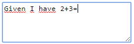
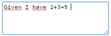

# napkinmathJS
do napkin math inside a &lt;textarea>

To use: type some (any) text: 

After typing '= ' (i.e. a space after the equals), you'll get the result inserted while you can just type on: 

(State: braindump / pre-alpha)

License: [Apache 2.0](http://www.apache.org/licenses/LICENSE-2.0)
